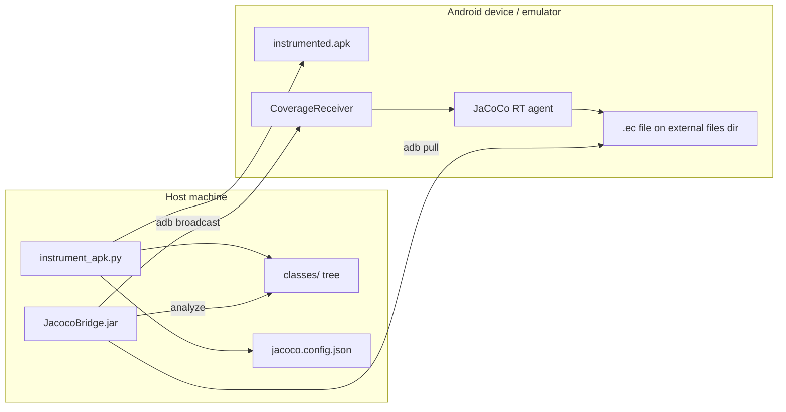

# JaCoCo instrumentation — complete guide

This document is the **single reference** for JaCoCo code coverage in TestCube. It covers requirements, one-time setup, instrumentation (any APK or open-source Gradle), device install, coverage collection, TestCube integration, configuration, outputs, troubleshooting, and limitations.

The implementation lives in `jococo_test/` and is **compatible with LLMDroid**: same broadcast action, same `JacocoBridge.jar`, same `.ec` file format. See also `compare/LLMDroid/documents/Instrumentation.md` for the original LLMDroid write-up.

---

## Table of contents

1. [What this does](#what-this-does)
2. [How it works (architecture)](#how-it-works-architecture)
3. [Requirements](#requirements)
4. [One-time setup](#one-time-setup)
5. [Path A — instrument any APK](#path-a--instrument-any-apk)
6. [Path B — open-source Gradle project](#path-b--open-source-gradle-project)
7. [Install on device and smoke-test](#install-on-device-and-smoke-test)
8. [Collect coverage (standalone)](#collect-coverage-standalone)
9. [Run TestCube with live JaCoCo sampling](#run-testcube-with-live-jacoco-sampling)
10. [Configuration reference (`jacoco.config.json`)](#configuration-reference-jacococonfigjson)
11. [CLI reference (all scripts and flags)](#cli-reference-all-scripts-and-flags)
12. [Output files](#output-files)
13. [Folder layout](#folder-layout)
14. [JaCoCo vs AndroLog](#jacoco-vs-androlog)
15. [Troubleshooting](#troubleshooting)
16. [Limitations](#limitations)
17. [End-to-end example](#end-to-end-example)

---

## What this does

JaCoCo measures **method-level code coverage**: which methods in the app were executed during a test run.

Unlike AndroLog (logcat probes baked into the APK by Soot), JaCoCo uses:

1. **Offline bytecode instrumentation** — probes inserted into every method at build/instrument time.
2. **A runtime agent** (`org.jacoco.agent.rt.RT`) — records which probes fired.
3. **A broadcast receiver** — dumps execution data to a binary `.ec` file on demand.
4. **JacocoBridge** — sends the broadcast, pulls the `.ec` file, and compares it against instrumented `.class` files to compute a percentage.

TestCube can sample this percentage during a `droidbot` run (`--code-coverage jacoco`) or you can collect it manually after a run.

---

## How it works (architecture)



**Runtime sequence (each coverage sample):**

1. `JacocoBridge` runs: `adb shell am broadcast -a com.llmdroid.jacoco.COLLECT_COVERAGE --es coverageFile <name>.ec`
2. `CoverageReceiver` in the app calls `RT.getAgent().getExecutionData(true)` and writes bytes to  
   `/storage/emulated/0/Android/data/<package>/files/<name>.ec`
3. `JacocoBridge` runs: `adb pull <ec path> <local dir>`
4. JaCoCo `Analyzer` loads the `.ec` file + the host-side `classes/` tree → **method coverage %**

**Broadcast action (do not change without updating both sides):**

```
com.llmdroid.jacoco.COLLECT_COVERAGE
```

**Broadcast extra:**

| Key | Meaning |
|-----|---------|
| `coverageFile` | Filename only (written under `getExternalFilesDir(null)`) |

---

## Requirements

### System tools

| Tool | Version / notes | Purpose | Install |
|------|-----------------|---------|---------|
| **Java** | 8+ (JDK) | `jacococli`, `JacocoBridge`, `javac` | `brew install openjdk` or system JDK |
| **apktool** | 2.x | Decode/rebuild APK without disassembling dex | `brew install apktool` |
| **dex-tools** | dex2jar | `d2j-dex2jar`, `d2j-jar2dex` on `PATH` | [pxb1988/dex2jar](https://github.com/pxb1988/dex2jar) releases |
| **Android SDK** | API 34 platform recommended | `zipalign`, `apksigner`, `d8` | [Android Studio](https://developer.android.com/studio) or command-line tools |
| **adb** | From platform-tools | Install APK, broadcast, pull `.ec` | Included with Android SDK |

### Environment variables

| Variable | Required | Purpose |
|----------|----------|---------|
| `ANDROID_HOME` or `ANDROID_SDK_ROOT` | Yes (for instrumentation + signing) | Locates `build-tools`, `platforms` |
| `ANDROID_API` | No (default `34`) | Platform jar for building `jacoco_support.dex` |

Example (macOS, add to `~/.zshrc`):

```bash
export ANDROID_HOME="$HOME/Library/Android/sdk"
export PATH="$ANDROID_HOME/platform-tools:$ANDROID_HOME/build-tools/34.0.0:$PATH"
```

### Python dependencies

| Package | Required when | Install |
|---------|---------------|---------|
| TestCube / `androguard` | `instrument_apk.py` (reads package name) | Already in TestCube venv: `pip install -e .` |
| **jpype1** | Live sampling inside `droidbot --code-coverage jacoco` | `pip install jpype1` |

Activate the project venv before running scripts:

```bash
cd /path/to/TestCube-2.0
source .venv/bin/activate   # or your venv path
```

### Bundled JaCoCo artifacts (copied by `setup.sh`)

| File | Role |
|------|------|
| `lib/jacococli.jar` | Offline APK class instrumentation |
| `lib/jacocoagent.jar` | JaCoCo agent (reference) |
| `lib/org.jacoco.agent-0.8.8.202204050719.jar` | Runtime classes merged into support dex |
| `lib/org.jacoco.core-0.8.8.202204050719.jar` | Core library (JacocoBridge build) |
| `JacocoBridge/JacocoBridge.jar` | Host-side broadcast + pull + analyze |

Source of truth for jars: `compare/LLMDroid/JacocoBridge/lib/` (JaCoCo **0.8.8**).

### Device / emulator

| Requirement | Notes |
|-------------|-------|
| Android emulator or physical device | `adb devices` must show `device` |
| API level | Instrumented APK is built with `--min-api 21`; emulator API 28+ recommended |
| Storage permission | `.ec` files go to app external files dir; use `adb install -r -g` to grant runtime permissions |

---

## One-time setup

From the **repository root**:

```bash
# 1. Ensure ANDROID_HOME is set (see above)
echo $ANDROID_HOME

# 2. Install host tools (macOS examples)
brew install apktool openjdk
# dex-tools: download from GitHub, add d2j-dex2jar and d2j-jar2dex to PATH

# 3. Activate Python environment
source .venv/bin/activate
pip install jpype1          # only if you use droidbot --code-coverage jacoco

# 4. Run jococo_test setup
bash jococo_test/setup.sh
```

**What `setup.sh` does:**

1. Copies JaCoCo jars from `compare/LLMDroid/JacocoBridge/lib/` into `jococo_test/lib/` (if missing).
2. Copies prebuilt `JacocoBridge.jar` from compare (if missing).
3. Verifies `jacococli.jar`, `org.jacoco.core-*.jar`, and `jacocoagent.jar` exist.
4. Runs `scripts/build_receiver.sh` when `ANDROID_HOME` is set → produces `templates/jacoco_support.dex`.

**Verify setup:**

```bash
test -f jococo_test/lib/jacococli.jar && echo "jacococli OK"
test -f jococo_test/JacocoBridge/JacocoBridge.jar && echo "JacocoBridge OK"
test -f jococo_test/templates/jacoco_support.dex && echo "support dex OK" || echo "Run setup.sh with ANDROID_HOME set"
which apktool d2j-dex2jar d2j-jar2dex adb java
```

---

## Path A — instrument any APK

Use this for **closed-source or prebuilt APKs** (e.g. `apks/spotube.apk`). No source code required.

### Command

```bash
python jococo_test/scripts/instrument_apk.py apks/<app>.apk
```

Optional flags:

| Flag | Default | Meaning |
|------|---------|---------|
| `--out DIR` | `jococo_test/output/<stem>` | Output directory |
| `--ec-name NAME` | `<package>_coverage.ec` | Runtime `.ec` filename |
| `--keystore PATH` | `jococo_test/templates/debug.keystore` | Signing keystore (auto-created) |
| `--skip-sign` | off | Produce unsigned APK (not installable on most devices) |
| `--keep-work` | off | Keep temp decode/instrument dir for debugging |

### Pipeline (what the script does)

1. **`apktool d -s -f <apk> -o work/decoded`** — decode APK but keep binary `classes*.dex` (no smali disassembly).
2. **For each `classes.dex`, `classes2.dex`, …**
   - `d2j-dex2jar` → `.jar`
   - `java -jar jacococli.jar instrument <jar> --dest <instrumented.jar>`
   - Extract `.class` files into `output/<stem>/classes/` (used later by JacocoBridge)
   - `d2j-jar2dex` → replace dex in decoded tree
3. **Copy `templates/jacoco_support.dex`** as the next `classesN.dex` (JaCoCo runtime + `CoverageReceiver`).
4. **Patch `AndroidManifest.xml`** — register exported receiver:
   ```xml
   <receiver android:name="com.testcube.jacoco.CoverageReceiver" android:exported="true">
       <intent-filter>
           <action android:name="com.llmdroid.jacoco.COLLECT_COVERAGE"/>
       </intent-filter>
   </receiver>
   ```
5. **`apktool b`** → unsigned APK.
6. **`zipalign` + `apksigner`** with debug keystore → `instrumented.apk`.
7. **Write `jacoco.config.json`** with package name, paths, and `.ec` filename.

### Outputs

```
jococo_test/output/<stem>/
  instrumented.apk       # Install this
  classes/               # Instrumented .class tree (host-side, for analysis)
  jacoco.config.json     # Paths for collection / droidbot
```

---

## Path B — open-source Gradle project

Use this when you have the **Android source** and `dex2jar` fails on the release APK (common on API 34+).

### 1. Patch the project

```bash
python jococo_test/scripts/patch_gradle.py /path/to/android/project
```

Optional: `--activity /path/to/MainActivity.java` if auto-detection fails.

**What it adds:**

- `apply plugin: 'jacoco'` and `testCoverageEnabled true` on debug build type.
- `app/src/main/java/com/testcube/jacoco/CoverageReceiver.java`
- Receiver registration in the launch Activity (`onCreate` / `onDestroy`).

### 2. Build debug APK

```bash
cd /path/to/android/project
./gradlew assembleDebug
```

### 3. Copy class files and write config

```bash
STEM=newpipe   # example
mkdir -p jococo_test/output/$STEM/classes
cp -r app/build/intermediates/javac/debug/classes/* jococo_test/output/$STEM/classes/

# Install the debug APK from app/build/outputs/apk/debug/
adb install -r -g app/build/outputs/apk/debug/app-debug.apk
```

Create `jococo_test/output/$STEM/jacoco.config.json` (adjust package and paths):

```json
{
  "AppName": "NewPipe",
  "package": "org.schabi.newpipe.debug",
  "EcFilePath": "/storage/emulated/0/Android/data/org.schabi.newpipe.debug/files",
  "EcFileName": "org_schabi_newpipe_debug_coverage.ec",
  "ClassFilePath": "/absolute/path/to/TestCube-2.0/jococo_test/output/newpipe/classes",
  "BroadcastAction": "com.llmdroid.jacoco.COLLECT_COVERAGE"
}
```

`EcFilePath` must match `getExternalFilesDir(null)` for that package (same as LLMDroid's `newpipe-jacoco.json`).

---

## Install on device and smoke-test

```bash
# List devices
adb devices

# Install instrumented APK (-g grants runtime permissions)
adb install -r -g jococo_test/output/<stem>/instrumented.apk

# Launch the app manually or via monkey
adb shell monkey -p <package> -c android.intent.category.LAUNCHER 1

# Trigger coverage dump (use EcFileName from jacoco.config.json)
adb shell am broadcast -a com.llmdroid.jacoco.COLLECT_COVERAGE \
  --es coverageFile <package_with_underscores>_coverage.ec

# Confirm .ec file exists on device (path from jacoco.config.json EcFilePath)
adb shell ls -la /storage/emulated/0/Android/data/<package>/files/
```

**Expected logcat** (filter `CoverageReceiver`):

```
adb logcat -s CoverageReceiver
# I/CoverageReceiver: Wrote coverage to /storage/emulated/0/Android/data/.../files/....ec
```

If broadcast succeeds but no file appears, the JaCoCo runtime may not be initialized (instrumentation failed or app crashed on start).

---

## Collect coverage (standalone)

After a manual test session or a `droidbot` run, sample coverage without re-driving the UI:

### Single sample

```bash
python jococo_test/scripts/collect_coverage.py \
  --config jococo_test/output/<stem>/jacoco.config.json
```

### Watch mode (sample every 3 seconds)

```bash
python jococo_test/scripts/collect_coverage.py \
  --config jococo_test/output/<stem>/jacoco.config.json \
  --watch 300 \
  --out jococo_test/output/<stem>/codecoverage.txt
```

### Flags

| Flag | Default | Meaning |
|------|---------|---------|
| `--config` | (required) | Path to `jacoco.config.json` |
| `--device SERIAL` | default device | `adb -s` serial |
| `--jar PATH` | `jococo_test/JacocoBridge/JacocoBridge.jar` | Bridge JAR |
| `--watch SECONDS` | `0` (one shot) | Repeat sampling for N seconds |
| `--out PATH` | `<config_dir>/codecoverage.txt` | Output file |
| `--pull-dir PATH` | config directory | Where pulled `.ec` files land |

### Using JacocoBridge.jar directly (LLMDroid style)

```bash
java -jar jococo_test/JacocoBridge/JacocoBridge.jar \
  -t 60 \
  --classFile /absolute/path/to/jococo_test/output/<stem>/classes \
  --ecFilePath /storage/emulated/0/Android/data/<package>/files \
  --ecFileName <package>_coverage.ec \
  --pullPath jococo_test/output/<stem> \
  -o jococo_test/output/<stem>/codecoverage.txt
```

Optional: `-s <device_serial>` for multiple devices.

---

## Run TestCube with live JaCoCo sampling

JaCoCo sampling is wired into `droidbot` as an **observer** (does not affect exploration policy).

### Prerequisites

- Instrumented APK installed (or pass instrumented APK path to `-a`).
- `jacoco.config.json` from instrumentation step.
- `jpype1` installed in the active venv.

### Command

```bash
source .venv/bin/activate
adb devices

droidbot -a jococo_test/output/<stem>/instrumented.apk \
  -o output/<stem>-jacoco \
  -is_emulator \
  --code-coverage jacoco \
  --jacoco-config jococo_test/output/<stem>/jacoco.config.json
```

### droidbot coverage flags

| Flag | Values | Meaning |
|------|--------|---------|
| `--code-coverage` | `none`, `androlog`, `jacoco` | Coverage backend |
| `--jacoco-config` | path to JSON | **Required** when `jacoco` |
| `--coverage-interval` | integer (default 10) | Sample every N injected events |

AndroLog-only flags (`--coverage-tag`, `--coverage-total-methods`) are ignored for JaCoCo.

### Run outputs

| File | Content |
|------|---------|
| `output/<run>/codecoverage.txt` | LLMDroid-compatible series (`NN.NNNNN%` per line) |
| `output/<run>/code_coverage.json` | Summary JSON (`final_coverage`, `samples`, …) |
| `output/<run>/.ec` files | Pulled execution data (alongside config dir if shared) |

---

## Configuration reference (`jacoco.config.json`)

Written automatically by `instrument_apk.py`; edit manually for Gradle path.

| Field | Required | Example | Meaning |
|-------|----------|---------|---------|
| `package` | yes | `com.example.app` | Application ID |
| `EcFilePath` | yes | `/storage/emulated/0/Android/data/com.example.app/files` | Device directory for `.ec` files |
| `EcFileName` | yes | `com_example_app_coverage.ec` | Filename passed as `coverageFile` extra |
| `ClassFilePath` | yes | `/abs/path/jococo_test/output/app/classes` | Host-side instrumented `.class` tree |
| `BroadcastAction` | no | `com.llmdroid.jacoco.COLLECT_COVERAGE` | Documented for reference |
| `instrumented_apk` | no | path to APK | Convenience pointer |
| `AppName` | no | `spotube` | Human label |

**Snake_case aliases** accepted by collectors: `ec_file_path`, `ec_file_name`, `class_file_path`.

Example template: `jococo_test/templates/config.example.json`.

---

## CLI reference (all scripts and flags)

### `setup.sh`

```bash
bash jococo_test/setup.sh
```

No flags. Requires `ANDROID_HOME` to build `jacoco_support.dex`.

### `scripts/build_receiver.sh`

```bash
bash jococo_test/scripts/build_receiver.sh
```

Builds `templates/jacoco_support.dex` from `CoverageReceiver.java` + JaCoCo agent jar. Called by `setup.sh`.

### `scripts/instrument_apk.py`

```bash
python jococo_test/scripts/instrument_apk.py <apk> [--out DIR] [--ec-name NAME] [--keystore PATH] [--skip-sign] [--keep-work]
```

### `scripts/patch_gradle.py`

```bash
python jococo_test/scripts/patch_gradle.py <android_project_root> [--activity PATH]
```

### `scripts/collect_coverage.py`

```bash
python jococo_test/scripts/collect_coverage.py --config <jacoco.config.json> [--device SERIAL] [--jar PATH] [--watch SEC] [--out PATH] [--pull-dir PATH]
```

### `JacocoBridge/build.sh`

```bash
bash jococo_test/JacocoBridge/build.sh
```

Rebuilds `JacocoBridge.jar` from source (needs `lib/org.jacoco.core-*.jar`).

---

## Output files

### Per-app directory (`jococo_test/output/<stem>/`)

| File / dir | Produced by | Purpose |
|------------|-------------|---------|
| `instrumented.apk` | `instrument_apk.py` | Signed APK to install |
| `classes/` | `instrument_apk.py` | JaCoCo analyzer input (instrumented bytecode) |
| `jacoco.config.json` | `instrument_apk.py` | Collection + droidbot config |
| `codecoverage.txt` | `collect_coverage.py` or droidbot | Time series of coverage % |
| `*.ec` | device (via broadcast) | Binary execution data (pulled by bridge) |
| `.coverage_once.txt` | JacocoBridge one-shot | Temporary single-sample output |

### `codecoverage.txt` format

```
code coverage
start time: 2026-09-03 14:30:00
12.34567%
15.67890%
```

Each percentage line is **method coverage** = covered methods / total methods in the `classes/` tree.

---

## Folder layout

```
jococo_test/
  INSTRUMENTATION.md          ← this document
  README.md                   ← short pointer here
  setup.sh                    ← one-time host setup
  lib/                          JaCoCo 0.8.8 jars
  JacocoBridge/
    JacocoBridge.jar            prebuilt bridge (LLMDroid-compatible)
    build.sh                    rebuild jar from source
    src/org/jacoco/examples/JacocoBridge.java
  android/com/testcube/jacoco/
    CoverageReceiver.java       broadcast → .ec writer
  templates/
    jacoco_support.dex          built by setup.sh (runtime + receiver)
    config.example.json
    debug.keystore              auto-created on first instrument
  scripts/
    instrument_apk.py           universal APK instrumentation
    patch_gradle.py             open-source Gradle patch
    collect_coverage.py         standalone collector
    build_receiver.sh           compile support dex
  monitor/
    jacoco_monitor.py           droidbot integration (jpype)
  tests/
    test_instrument.py
  output/                       per-app artifacts (gitignored except .gitkeep)
```

---

## JaCoCo vs AndroLog

TestCube also supports **AndroLog** (`docs/CODE_COVERAGE.md`, `scripts/instrument_apk.py` at repo root). Do not mix them on the same comparison run without understanding the differences.

| | **AndroLog** | **JaCoCo** (`jococo_test/`) |
|---|--------------|------------------------------|
| Instrumentation | Soot bytecode probes in APK | jacococli offline + JaCoCo runtime dex |
| Works on closed APK | Yes | Yes (dex2jar path) |
| Needs source | No | Optional (Gradle path) |
| Runtime signal | logcat `METHOD=` lines | broadcast + `.ec` file |
| Denominator | Distinct probes in APK dex | Methods in instrumented `classes/` |
| TestCube flag | `--code-coverage androlog` | `--code-coverage jacoco` |
| LLMDroid flag | `-code_coverage androlog` | `-code_coverage jacoco` |
| Comparable to LLMDroid | Yes (same probes) | Yes (same JacocoBridge) |

JaCoCo and AndroLog percentages measure **different things** — do not compare raw numbers across methods.

---

## Troubleshooting

### `setup.sh` — missing jars

```
Missing jococo_test/lib/jacococli.jar
```

Copy from `compare/LLMDroid/JacocoBridge/lib/` or download [JaCoCo 0.8.8](https://www.jacoco.org/jacoco/).

### `setup.sh` — skip receiver build

```
ANDROID_HOME not set; skip receiver build
```

Export `ANDROID_HOME`, then re-run `bash jococo_test/setup.sh`.

### `instrument_apk.py` — missing `jacoco_support.dex`

```
Missing .../templates/jacoco_support.dex
```

Run `bash jococo_test/setup.sh` with `ANDROID_HOME` set, or manually:

```bash
bash jococo_test/scripts/build_receiver.sh
```

### `instrument_apk.py` — dex2jar fails

```
dex2jar failed for classes.dex
```

Common on **API 34+** or heavily obfuscated APKs. Use [Path B (Gradle)](#path-b--open-source-gradle-project) instead, or try a newer dex2jar build.

### `adb install` fails

- Use `-r -g` to replace and grant permissions.
- Uninstall the original app first if signature conflicts: `adb uninstall <package>`.
- Ensure APK was signed (`instrument_apk.py` signs by default; do not use `--skip-sign` unless you sign manually).

### Broadcast succeeds but coverage is 0%

1. Confirm the app was **launched and exercised** before sampling.
2. Check logcat: `adb logcat -s CoverageReceiver` for errors (`ClassNotFoundException: org.jacoco.agent.rt.RT` → runtime dex missing).
3. Verify `ClassFilePath` in config points to the **same instrumentation** that produced the installed APK.
4. Confirm `EcFilePath` matches the package on device:  
   `/storage/emulated/0/Android/data/<package>/files/`

### `collect_coverage.py` — `ClassFilePath not found`

Use an **absolute path** in `jacoco.config.json`, or re-run `instrument_apk.py` to regenerate config.

### `droidbot --code-coverage jacoco` — monitor not starting

| Symptom | Fix |
|---------|-----|
| `JacocoBridge.jar not found` | Run `bash jococo_test/setup.sh` |
| `jpype1` import error | `pip install jpype1` |
| `--jacoco-config is required` | Pass path to `jacoco.config.json` |
| Samples always time out | Increase device responsiveness; check adb connection |

### JVM / JacocoBridge errors

Rebuild the bridge:

```bash
bash jococo_test/JacocoBridge/build.sh
```

---

## Limitations

1. **dex2jar fidelity** — Converting dex ↔ jar can fail or lose semantics on modern bytecode. Gradle path is more reliable for open-source apps.
2. **External storage path** — `.ec` files use `getExternalFilesDir(null)`. Apps that block external storage may need the Gradle-integrated receiver with a custom path.
3. **Multidex** — Each `classesN.dex` is instrumented separately; very large apps need sufficient JVM heap (`java -Xmx8g` if you extend the scripts).
4. **Obfuscated apps** — Short class/method names still instrument, but analysis reports obfuscated names.
5. **Not interchangeable with AndroLog metrics** — Different denominators and measurement pipelines.
6. **Signing** — Default debug keystore is for **testing only**, not distribution.

---

## End-to-end example

Instrument Spotube, install on emulator, run TestCube, collect coverage.

```bash
# --- host setup (once) ---
cd ~/Projects/TestCube-2.0
source .venv/bin/activate
export ANDROID_HOME="$HOME/Library/Android/sdk"
bash jococo_test/setup.sh

# --- instrument ---
python jococo_test/scripts/instrument_apk.py apks/spotube.apk
# Note outputs: jococo_test/output/spotube/{instrumented.apk, classes/, jacoco.config.json}

# --- emulator ---
$ANDROID_HOME/emulator/emulator -avd Pixel_5 &
adb wait-for-device

# --- install ---
adb install -r -g jococo_test/output/spotube/instrumented.apk

# --- smoke test ---
adb shell monkey -p $(python -c "import json; print(json.load(open('jococo_test/output/spotube/jacoco.config.json'))['package'])") 1
EC=$(python -c "import json; print(json.load(open('jococo_test/output/spotube/jacoco.config.json'))['EcFileName'])")
adb shell am broadcast -a com.llmdroid.jacoco.COLLECT_COVERAGE --es coverageFile "$EC"

# --- TestCube run with live JaCoCo ---
droidbot -a jococo_test/output/spotube/instrumented.apk \
  -o output/spotube-jacoco \
  -is_emulator \
  --code-coverage jacoco \
  --jacoco-config jococo_test/output/spotube/jacoco.config.json

# --- after run: standalone collection ---
python jococo_test/scripts/collect_coverage.py \
  --config jococo_test/output/spotube/jacoco.config.json \
  --watch 60

# Results:
#   output/spotube-jacoco/codecoverage.txt
#   output/spotube-jacoco/code_coverage.json
#   jococo_test/output/spotube/codecoverage.txt  (if using --watch above)
```

---

## Related documentation

| Document | Topic |
|----------|-------|
| `compare/LLMDroid/documents/Instrumentation.md` | Original LLMDroid JaCoCo source patch guide |
| `compare/LLMDroid/JacocoBridge/README.md` | JacocoBridge standalone JAR usage |
| `docs/CODE_COVERAGE.md` | TestCube AndroLog coverage + LLMDroid comparison |
| `docs/PROJECT.md` | TestCube feature coverage (separate from code coverage) |
